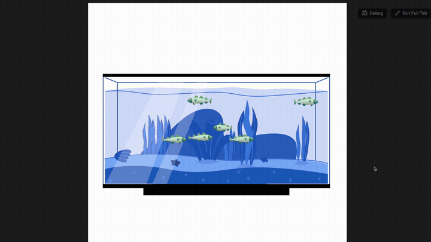

# AQUARIUM

[](https://github.com/beto-group/Aquarium)
[](https://github.com/beto-group/Aquarium)
[](https://github.com/beto-group/Aquarium)

A gamified, interactive visualizer that renders lists of tasks or habits as animated fish swimming in a dynamic Lottie-powered aquarium. It provides an immersive, edge-to-edge full-pane experience with sophisticated animation physics, user interaction, and a real-time developer bounds editor.



## Features

*   **Gamified Task Visualization**: Converts a plain list of tasks, habits, or items passed to the component into individual, animated swimming fish.
*   **Autonomous Swimming Simulation**: Each fish swims independently within custom limits, featuring random turn durations, vertical speed adjustments, and edge bounce physics.
*   **Interactive Controls**: Hover over any fish to pause its animation and show its task name in a floating tooltip, or click to pin/enlarge the fish for permanent focus.
*   **Real-time Developer Debugger**: Toggle a draggable debug panel with interactive sliders to calibrate the swim boundaries visually and copy the configuration directly to your clipboard.
*   **Performance Optimization**: Leverages requestAnimationFrame loops capped at 60 FPS, hardware-accelerated 3D transforms, and CSS will-change hints for smooth performance.

## Structure

The component's source directories are organized as follows:

| File / Folder | Purpose |
| :--- | :--- |
| **[AQUARIUM.md](AQUARIUM.md)** | Main entry point leaf. Mounts the Datacore component. |
| **[METADATA.md](METADATA.md)** | Machine-readable indexing manifest. |
| **[src/index.jsx](src/index.jsx)** | Handles dynamic file path calculations and bootstraps the main views. |
| **[src/App.jsx](src/App.jsx)** | Manages state, dynamic script loaders, full-tab style injection, and DOM setup. |
| **[src/components/Aquarium.jsx](src/components/Aquarium.jsx)** | Handles lottie assets container, debug overlays, and scale calculations. |
| **[src/components/FishComponent.jsx](src/components/FishComponent.jsx)** | Implements the swimming physics, collision boundaries, and interactive tooltips. |
| **[src/utils/loadScript.js](src/utils/loadScript.js)** | Dynamic library script downloader with filesystem caching. |
| **[assets/](assets)** | Holds the vector animation models and visual documentation assets. |

## Quick Start

Create an Obsidian note and paste the following snippet into it:

```datacorejsx
const activeFile = dc.resolvePath("AQUARIUM") || "_RESOURCES/DATACORE/AQUARIUM/AQUARIUM";
const folderPath = activeFile.substring(0, activeFile.lastIndexOf('/'));
const { View } = await dc.require(folderPath + "/src/index.jsx");
return await View({ 
  folderPath, 
  dc, 
  fishes: [
    { name: "Morning Exercise" },
    { name: "Read Research Papers" },
    { name: "Code New Features" }
  ] 
});
```

## Contributors

*   **firestorm** (Original creator of the Aquarium Visualizer)
